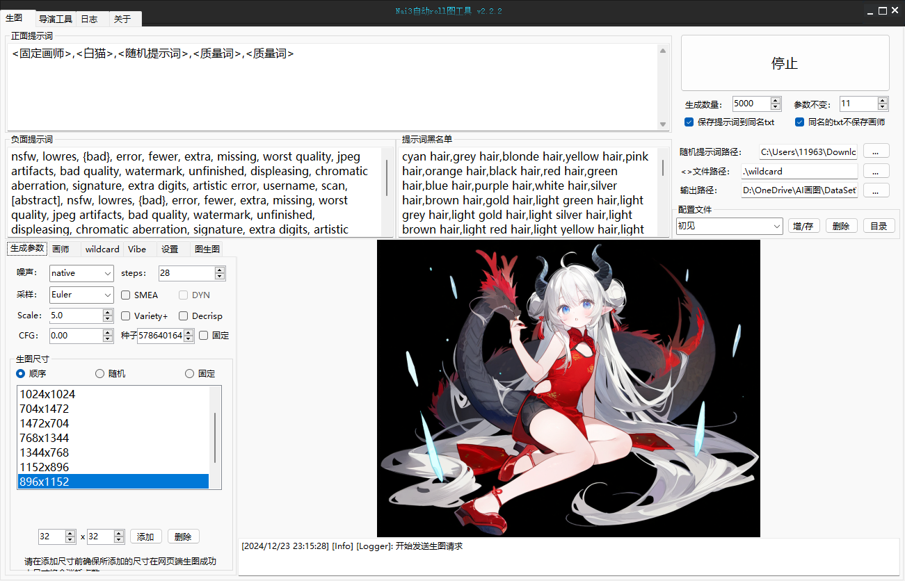

# NovalAi3 自动跑图工具

语言：简体中文 | [English](doc/README.en.md) | [日本語](doc/README.ja-JP.md)


面向 NovelAI 的 Windows 批量生图与导演工具客户端，提供多模型、Prompt 模板、Vibe/Img2Img 参考图与自动化跑图能力。

核心能力：随机组合画师串生成画风。通过 `<随机画师>` + 画师组列表 + 权重/保持控制，自动拼接画师串，用于批量稳定扩展风格（训练集场景尤为适用）。



## 目录
- [功能特性](#功能特性)
- [随机组合画师串生成画风](#随机组合画师串生成画风)
- [运行环境](#运行环境)
- [下载与安装](#下载与安装)
- [首次配置](#首次配置)
- [使用指南](#使用指南)
- [参数说明](#参数说明)
- [输出与文件命名](#输出与文件命名)
- [配置与文件位置](#配置与文件位置)
- [自动更新](#自动更新)
- [常见问题](#常见问题)
- [开发与构建](#开发与构建)
- [相关链接](#相关链接)
- [许可](#许可)

## 功能特性
- 核心能力：随机组合画师串生成画风，支持分组绑定、权重控制、参数保持，适合训练集批量生成。
- 批量生成与节奏控制：支持运行次数与长短休配置。
- 多模型支持：NAI2 / NAI3 / NAI3 Furry / NAI4 Preview / NAI4 Full / NAI4.5 Curated / NAI4.5 Full。
- Prompt 模板系统：随机提示词、Wildcard 等占位符可组合使用。
- 参考图能力：Vibe 多参考图（含 `.naiv4vibe`）、Img2Img 强度/噪声。
- 导演工具：背景抠图、线稿、草图、上色、表情、去杂，支持单图/批量。
- 输出与记录：PNG/WEBP、同名 TXT 保存 Prompt、文件名格式切换、日志落地。
- 预设管理：多套配置保存/切换，自动恢复上次关闭时的配置。
- 内置自动更新（基于 GitHub Releases）。

## 随机组合画师串生成画风
这是本工具的核心能力：通过 `<随机画师>` 将画师列表随机组合为“画师串”，用于批量生成具有变化但可控的画风，尤其适合训练集生产。

### 快速用法
1. 在 Prompt 中加入 `<随机画师>`；需要稳定主风格时叠加 `<固定画师>`。
2. 在“随机画师”列表维护画师组。
3. 设置“画师数量最小/最大”，控制每次抽取多少组。
4. 需要风格稳定时启用“随机画师不变”，并配合“参数固定数量”控制刷新频率。

### 画师组规则
- 每行一个画师组。
- 组内使用 `|` 绑定组合，抽中后整组一起输出。
- 适合把常用搭配画师放在同一组，形成稳定的画风组合。

示例列表：
```
# 组1：绑定组合
artistA|artistB
# 组2：单画师 + 权重参数
artistC,0,2,0,3
# 组3：双冒号权重
artistD::
```

可能输出（示例）：
```
artistA,artistB,artistC
1.2::artistD::
artistC
```

### 权重与风格控制
- `名称,减权最小,减权最大,加权最小,加权最大` 用于随机加权/减权。
- 画师名以 `::` 结尾时，会自动生成 `x::artist::` 形式的双冒号权重。
- 启用 “Artist Modify” 会为所有画师添加 `artist:` 前缀。

### 训练集建议
- 使用 `<固定画师>,<随机画师>`：固定主风格，随机扩展风格维度。
- 开启“随机画师不变”，并设置合理的“参数固定数量”（例如 3-5），让一组画师串覆盖多张图。
- 开启“保存提示词到同名 TXT”，便于训练集配套 Prompt 管理。

## 运行环境
- Windows 10/11
- .NET Framework 4.8
- NovelAI 账号 Token（可选配置代理）

## 下载与安装
1. 从 Releases 下载并解压：<https://github.com/CyanAutumn/NovalAi3AutoMatic/releases>
2. 运行 `AutoNai3Tools.exe`。
3. 首次运行会创建默认输出目录与配置文件。

## 首次配置
1. 设置 `Token`（NovelAI 账户获取）。
2. 如需代理，填写 `Proxy`，示例：`http://127.0.0.1:7890`。
3. 设置目录：
   - 输出目录 `OutputPath`
   - 随机提示词目录 `RandomPromptFolderPath`
   - Wildcard 目录 `WildcardFolderPath`
4. 根据需求调整模型、分辨率、Sampler、Steps 等参数。

## 使用指南

### 基础生图流程
1. 填写 Prompt / Negative Prompt。
2. 选择模型与生成参数（Steps、Sampler、Scale、CFG 等）。
3. 设定“跑图数量”和“参数固定数量”。
4. 点击“生成”，运行过程中可随时停止。

### Prompt 模板语法
| 语法 | 说明 | 示例 |
| --- | --- | --- |
| `<固定画师>` | 使用“固定画师”输入框内容 | `1girl, <固定画师>` |
| `<随机画师>` | 按画师列表随机组合 | `1girl, <随机画师>` |
| `<随机提示词>` | 从随机提示词目录随机抽取 | `<随机提示词>` |
| `<随机提示词:顺序>` | 按文件顺序轮换 | `<随机提示词:顺序>` |
| `<xxx>` | Wildcard：读取 `wildcard/xxx.txt` 随机一行 | `<衣服>` |
| `<xxx:顺序>` | Wildcard 顺序轮换 | `<衣服:顺序>` |

提示：
- 随机提示词目录中的每个 `.txt` 文件视为一个 Prompt（逗号分隔），换行会被当作空格处理。
- Wildcard 文件中每行一个候选词；点击界面中的片段可快速插入 Prompt。
- `<随机画师>` 是核心功能，详见 [随机组合画师串生成画风](#随机组合画师串生成画风)。
- 提示词黑名单与正则黑名单主要用于过滤“随机提示词”的结果。

### 随机提示词目录格式
目录内放置多个 `.txt`，每个文件代表一个 Prompt 片段：
```
1girl, solo, masterpiece, best quality
```
使用 `<随机提示词>` 会随机选一个文件；使用 `<随机提示词:顺序>` 会按文件顺序轮换。

### Wildcard 目录与管理
`wildcard/` 下每个 `.txt` 文件对应一个 `<xxx>` 占位符：
```
wildcard/
  衣服.txt
  发型.txt
```
`衣服.txt` 示例（每行一个候选词）：
```
hoodie
long coat
school uniform
```

### Vibe 参考图
- 支持多张参考图与 `.naiv4vibe` 文件。
- 每张图可设置 `informationExtracted` 与 `referenceStrength`。
- `.naiv4vibe` 首次使用会生成本地缓存文本，后续复用提升速度。

### Img2Img
- 选择输入图，设置 `Strength` 与 `Noise`。
- 未选择图片时不会发送 Img2Img 参数。

### 导演工具
- 支持：背景抠图、线稿、草图、上色、表情、去杂。
- 支持单图与文件夹批量。
- 上色/表情模式可填写额外 Prompt 与 Defry 参数。
- 输出结果统一保存到 `OutputPath`。

### 预设管理
- 可保存/加载/删除预设配置。
- 启动时自动加载 “上一次关闭时的自动保存” 预设。

### 分辨率与参数保持
- “参数固定数量”用于控制随机项刷新频率：
  - 例如值为 3 时：第 1 次生成刷新随机项，接下来 2 次保持不变，第 4 次再次刷新。
- 可分别控制是否保持：随机画师、Wildcard、随机提示词、分辨率。
- 分辨率模式：
  - 固定：始终使用当前分辨率
  - 顺序：按列表依次轮换
  - 随机：从列表随机选取

## 参数说明
| 参数 | 说明 | 备注 |
| --- | --- | --- |
| Model | 选择模型 | NAI2 / NAI3 / NAI3 Furry / NAI4 Preview / NAI4 Full / NAI4.5 Curated / NAI4.5 Full |
| Steps | 生成步数 | 1-28（超出会被自动限制） |
| Sampler | 采样器 | `k_euler` / `k_euler_ancestral` / `k_dpmpp_2s_ancestral` / `k_dpmpp_2m_sde` / `k_dpmpp_2m` / `k_dpmpp_sde` / `ddim_v3` |
| Noise Schedule | 噪声策略 | `native` / `karras` / `exponential` / `polyexponential` |
| Scale | Prompt Guidance | 0-10，保留 1 位小数 |
| CFG Rescale | CFG Rescale | 与 NovelAI 参数一致 |
| SMEA / DYN | 采样优化 | 关闭 SMEA 时 DYN 自动关闭 |
| Decrisp | 去锐化 | 与 NovelAI 参数一致 |
| Variety | 多样性参数 | 关 / 开 / 自定义_风险参数 |
| 分辨率 | Width / Height | 可通过分辨率列表与模式控制 |
| 分辨率列表 | 多行输入 | 格式：`832x1216` |
| 跑图数量 | RunNum | 每次点击生成的总次数 |
| 参数固定数量 | RunKeepParams | 控制随机项刷新频率 |
| 固定种子 | FixedSeeds | 关闭时每次生成自动随机 Seed |
| Seed | Seeds | 固定种子时生效 |
| 输出格式 | ImageFormat | PNG / WEBP |
| 输出文件名格式 | OutputFileNameFormat | NovalAI / 全画师词 / 日期 |
| 保存 Prompt | SavePromptToTxt | 可选保存原 Prompt 或不含画师的 Prompt |
| 代理 | Proxy | 仅在需要时填写 |
| 黑名单 | PromptBlackList / Regex | 主要用于随机提示词过滤 |

## 输出与文件命名
输出文件名由“输出文件名格式”决定：
- `NovalAI`：`{prompt} s-{seed}`
- `全画师词`：`{artist_summary}_{seed}`
- `日期`：`yyyyMMdd_HHmmss`

如启用“保存提示词到同名 TXT”，会在图片旁生成 `.txt` 文件。

## 配置与文件位置
| 项目 | 默认位置 | 说明 |
| --- | --- | --- |
| 输出目录 | `.\output` | 可在设置中修改 |
| Wildcard 目录 | `.\wildcard` | 存放 `*.txt` 片段 |
| 随机提示词目录 | `.\prompt\prompt_by_风吟` | 存放 `*.txt` Prompt |
| 预设配置 | `C:\Users\Public\Documents\auto_nai3_2\*.toml` | 预设保存位置 |
| 系统配置 | `C:\Users\Public\Documents\auto_nai3_system\config.toml` | Token、休眠时间等 |
| 运行日志 | `logs/mylog.txt` | log4net 输出 |

## 自动更新
非调试模式启动时会自动检查更新，更新源为 GitHub Releases。

## 常见问题
1. Token 无效或请求失败  
   检查 Token 是否过期，确保网络可访问 NovelAI 服务。

2. Wildcard/随机提示词无效  
   确认目录存在且包含 `.txt` 文件，路径不要为空。

3. 生成无预览但文件已保存  
   可能是 WebP 预览解码失败，图片文件仍会写入输出目录。

4. 无法保存配置  
   确认 `C:\Users\Public\Documents\` 目录有写入权限。

## 开发与构建
- 依赖：Visual Studio 2022 + .NET Framework 4.8
- 打开 `AutoNai3Tools.sln`，还原 NuGet 包并选择 `Release` 编译。
- 项目结构：
  - `controllers/` 生成流程与导演工具控制器
  - `services/` 配置与 Wildcard 服务
  - `utils/` 请求封装、日志、Prompt 解析、Vibe 处理
  - `body/` 不同模型的请求体构建

## 相关链接
- 使用教程：<https://cyanautumn.github.io/NovalAi3AutoMaticDoc/>
- Prompt 解析：<https://spell.novelai.dev/>
- WD-Tagger：<https://huggingface.co/spaces/SmilingWolf/wd-tagger>
